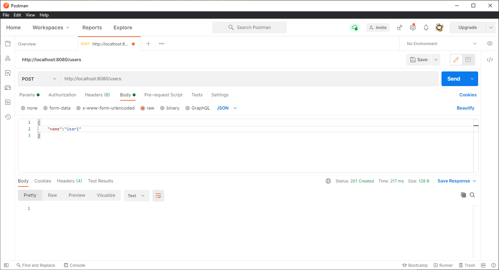
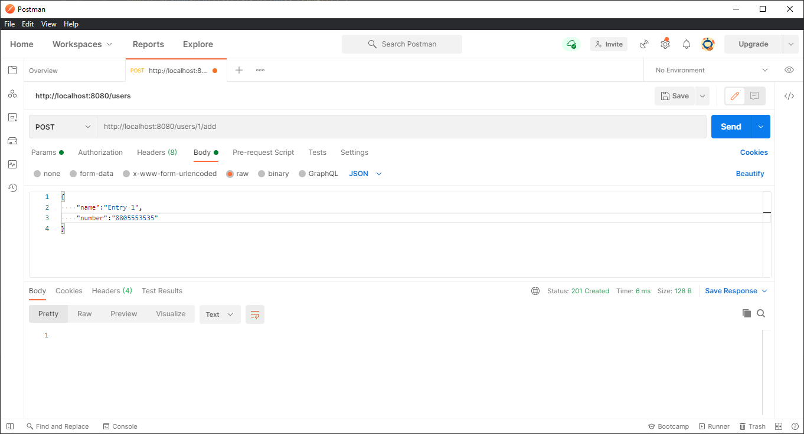
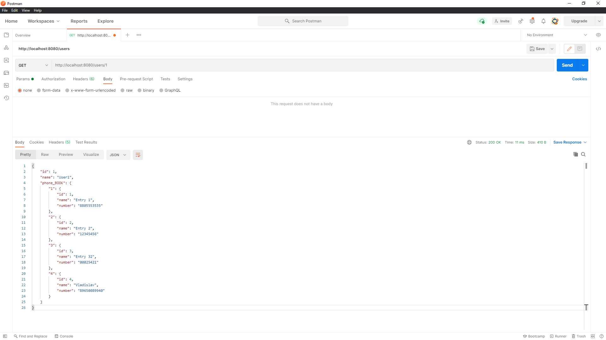
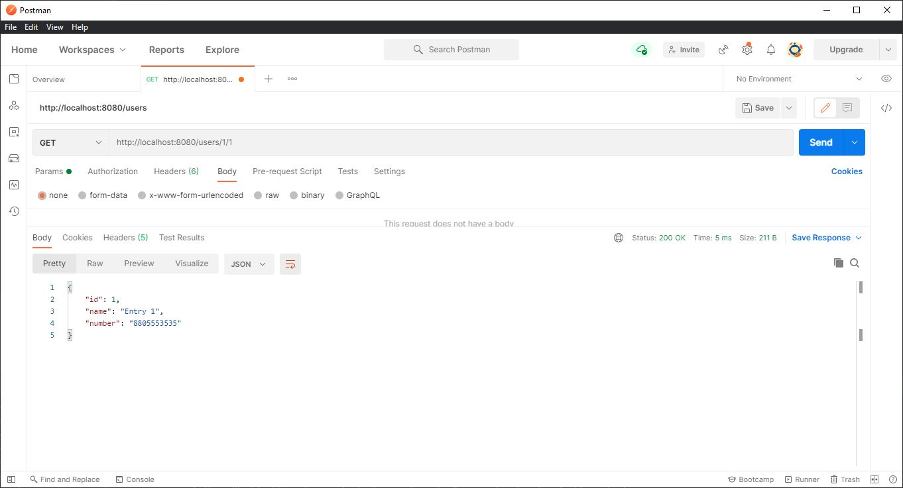
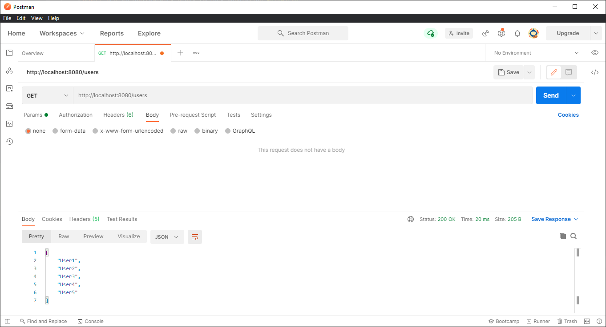
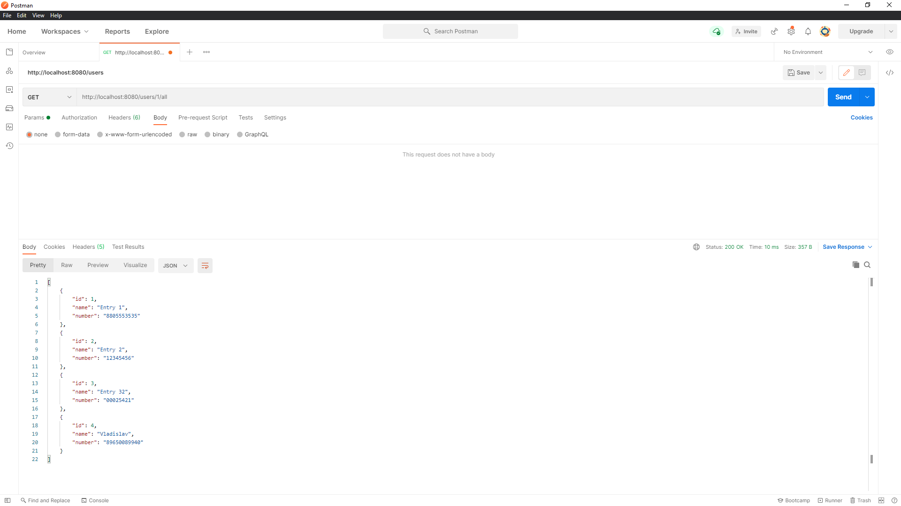
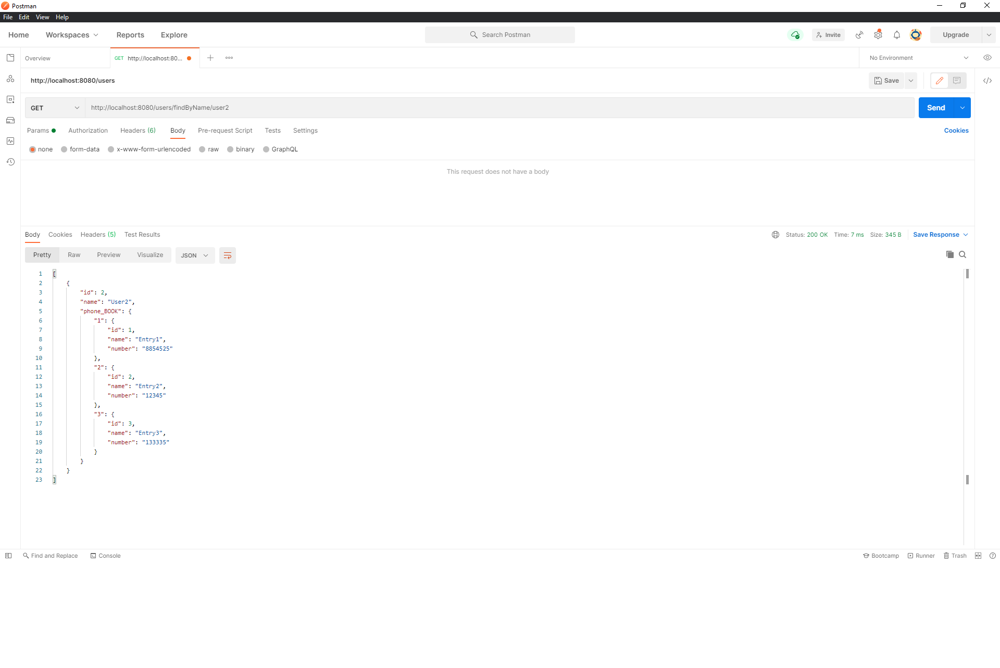
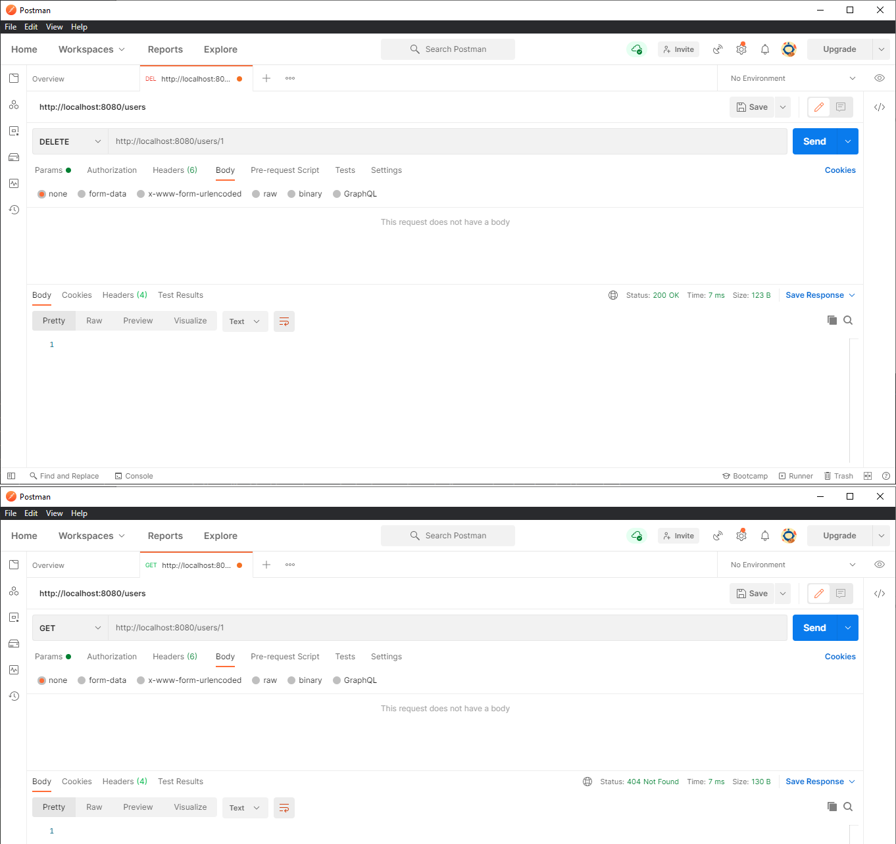
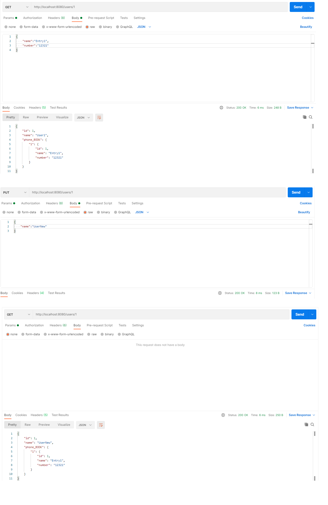

# phone_book📲
Описание:

Код программы и юнит тесты расположены в :

    UserController : src/main/java/vsb/phone_book,

    UserService, pbEntryService : src/main/java/vsb/phone_book/service,

    Юнит тесты модулей: src/test/java/vsb/phone_book
    
Скриншоты вызова различных REST методов в Postman:

